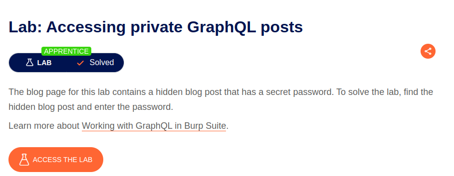

# Homework 11. SSRF, SSTI, API attacks

## Task 1. Command Injection

The [lab](https://portswigger.net/web-security/os-command-injection/lab-simple) is solved via sending `|whoami` injection with `storeId` POST parameter to `/product/stock` endpoint:

```http
storeId=1|whoami
```


## Task 2. GraphQL

The app in the [lab](https://portswigger.net/web-security/graphql/lab-graphql-reading-private-posts) provides graphQL API.  
Using inQL BurpSuite extension the API was introspected and `getBlogPost` query found.  
Request the hidden blogpost (id: 3) via the API and the password is found:

```graphQL
query getBlogSummaries {
    getBlogPost(id: 3) {
        author
        date # Timestamp scalar
        id
        image
        isPrivate
        paragraphs
        postPassword
        summary
        title
    }
}
```



## Task 3. API

The app in the [lab](https://portswigger.net/web-security/api-testing/lab-exploiting-api-endpoint-using-documentation) exposes **interactive, not protected** API documentation on `/api` endpoint.

The documentation is accessed and `carlos` is remove manually:


The lab is solved:


