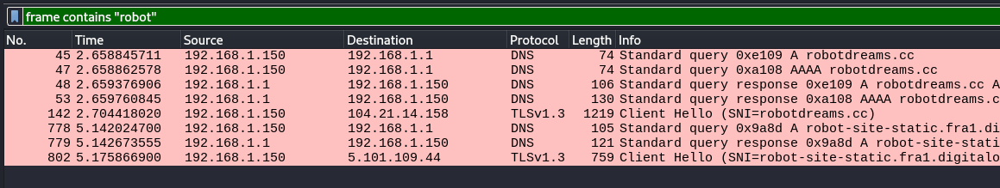
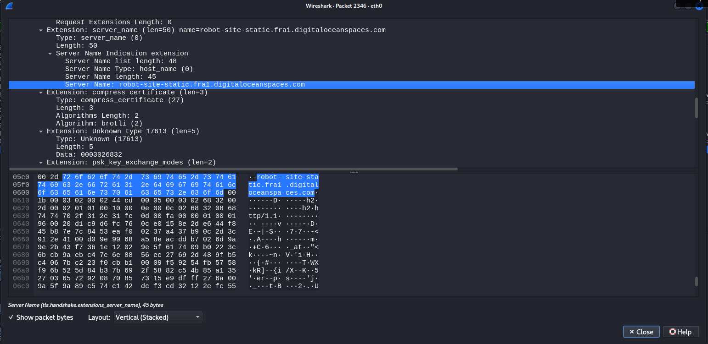
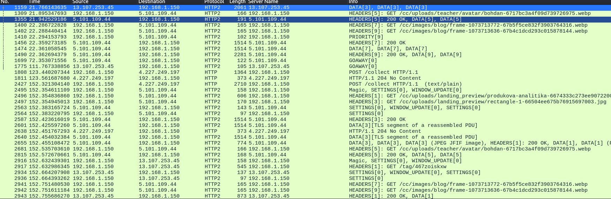
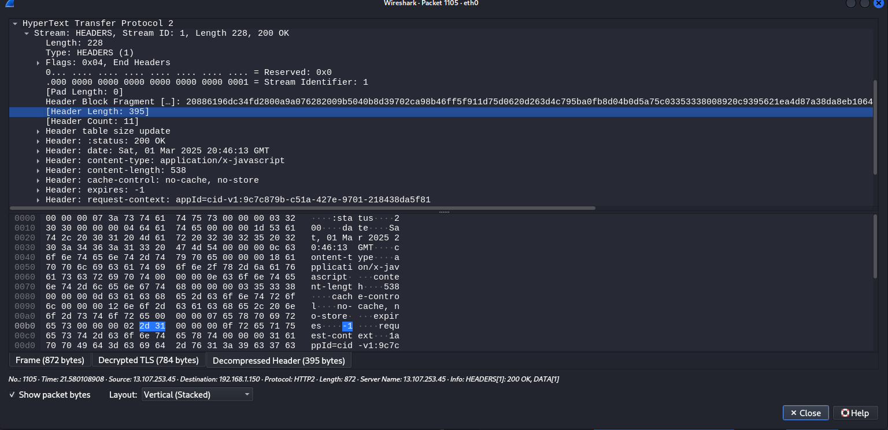

# Homework 4. Network Security

Setup:

- Working machine: Kali Linux VM
- Target machine: [Metasploitable2](https://sourceforge.net/projects/metasploitable/files/Metasploitable2/)

The machines are connected via bridge network

## Task 1. Server ports scanning

The target machine ports are scanned via `nmap -sV`

The result of scanning:

| PORT     | STATE | SERVICE                                     | VERSION                                      |
| -------- | ----- | ------------------------------------------- | -------------------------------------------- |
| 21/tcp   | open  | <span style="color:green">ftp</span>        | vsftpd 2.3.4                                 |
| 22/tcp   | open  | <span style="color:green">ssh</span>        | OpenSSH 4.7p1 Debian 8ubuntu1 (protocol 2.0) |
| 23/tcp   | open  | telnet                                      | Linux telnetd                                |
| 25/tcp   | open  | smtp                                        | Postfix smtpd                                |
| 53/tcp   | open  | domain                                      | ISC BIND 9.4.2                               |
| 80/tcp   | open  | <span style="color:green">http</span>       | Apache httpd 2.2.8 ((Ubuntu) DAV/2)          |
| 111/tcp  | open  | rpcbind                                     | 2 (RPC #100000)                              |
| 139/tcp  | open  | netbios-ssn                                 | Samba smbd 3.X - 4.X (workgroup: WORKGROUP)  |
| 445/tcp  | open  | netbios-ssn                                 | Samba smbd 3.X - 4.X (workgroup: WORKGROUP)  |
| 512/tcp  | open  | exec?                                       |                                              |
| 513/tcp  | open  | login                                       |                                              |
| 514/tcp  | open  | shell?                                      |                                              |
| 1099/tcp | open  | java-rmi                                    | GNU Classpath grmiregistry                   |
| 1524/tcp | open  | bindshell                                   | Metasploitable root shell                    |
| 2049/tcp | open  | nfs                                         | 2-4 (RPC #100003)                            |
| 2121/tcp | open  | <span style="color:green">ftp</span>        | ProFTPD 1.3.1                                |
| 3306/tcp | open  | <span style="color:green">mysql</span>      | MySQL 5.0.51a-3ubuntu5                       |
| 5432/tcp | open  | <span style="color:green">postgresql</span> | PostgreSQL DB 8.3.0 - 8.3.7                  |
| 5900/tcp | open  | vnc                                         | VNC (protocol 3.3)                           |
| 6000/tcp | open  | X11                                         | (access denied)                              |
| 6667/tcp | open  | irc                                         | UnrealIRCd                                   |
| 8009/tcp | open  | ajp13                                       | Apache Jserv (Protocol v1.3)                 |
| 8180/tcp | open  | <span style="color:green">http</span>       | Apache Tomcat/Coyote JSP engine 1.1          |

## Task 2. Wireshark

The expression for filtering traffic by word `robot`:

```bash
fragment contains "robot"
```

Since the connection of `https://robotdreams.cc` we can't filter site content. But there are some DNS and TLS handshake packets:


The packet content that contains word "robot":


### TLS decryption

One of the ways of TLS decryption in WireShark is (Pre)-Master-Secret
that can be generated by browser.  
Using this [guide](https://wiki.wireshark.org/TLS#using-the-pre-master-secret)
I've managed to see `HTTP` packets:


Even though WireShark allows to inspect decrypted and decompressed content (gzipped), there is no way to filter by it.


## Task 3. DNS Records analysis

The DNS records for `pentest-ground.com`:

| Type | Hostname                | IP Address     |
| ---- | ----------------------- | -------------- |
| A    | pentest-ground.com      | 178.79.134.182 |
| MX   | mail.pentest-ground.com | 192.248.188.61 |
| SOA  | ns1.linode.com          | 92.123.94.2    |
| SOA  | ns1.linode.com          | 2600:14c0:6::2 |
| NS   | ns3.linode.com          | 92.123.95.3    |
| NS   | ns3.linode.com          | 2600:14c0:7::3 |
| NS   | ns1.linode.com          | 92.123.94.2    |
| NS   | ns1.linode.com          | 2600:14c0:6::2 |
| NS   | ns2.linode.com          | 92.123.94.3    |
| NS   | ns2.linode.com          | 2600:14c0:6::3 |
| NS   | ns5.linode.com          | 92.123.95.2    |
| NS   | ns5.linode.com          | 2600:14c0:7::2 |
| NS   | ns4.linode.com          | 92.123.95.4    |
| NS   | ns4.linode.com          | 2600:14c0:7::4 |
