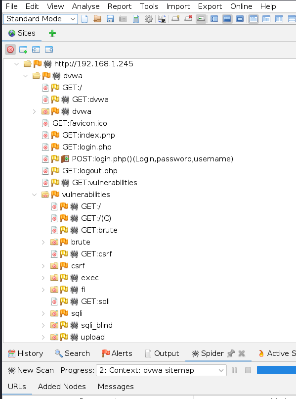
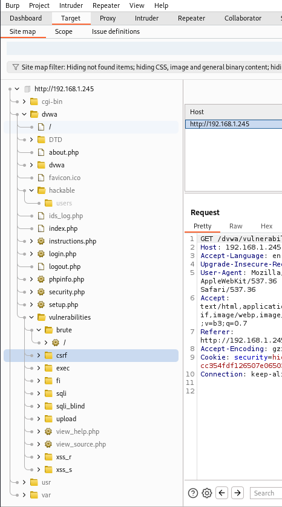
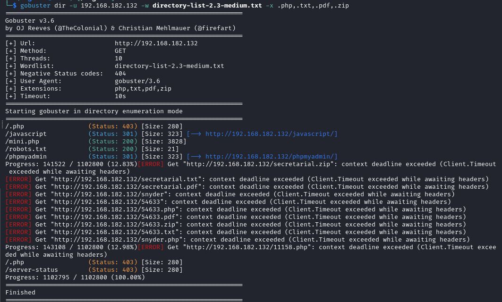
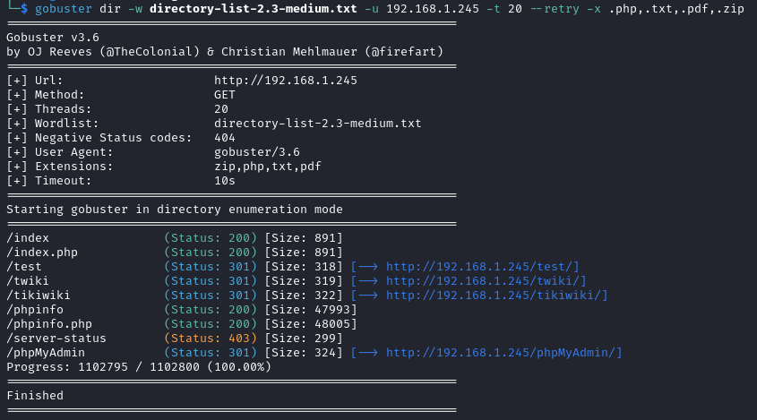
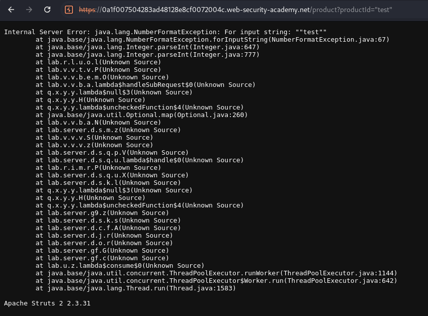

# Homework 5. Sitemap building

Setup:

- Working machine: Kali Linux VM
- Target machine: [Metasploitable2](https://sourceforge.net/projects/metasploitable/files/Metasploitable2/)

## Task 1. Introduction to the DAST tool

I've decided to make sitemap using both tools OWASP Zap and BurpSuite

The DVWA sitemap is built with OWASP Zap `spider` tool:

The DVWA sitemap is built with BurpSuite and manual scanning:

## Task 2. Directories scan

I've managed to create the machine at <https://portal.offsec.com>
and made one scan with gobuster but got some errors and during tweaking gobuster parameters ran out of free access.

So I also scanned DVWA app of metasploitable machine with gobuster.
The result of scanning on the image below:

## Task 3. Information disclosure in error messages lab

The [lab](https://portswigger.net/web-security/information-disclosure/exploiting/lab-infoleak-in-error-messages) web app has poor errors handling.  
Passing value of wrong type of `paroductId` query parameter reveals the error stacktrace:

