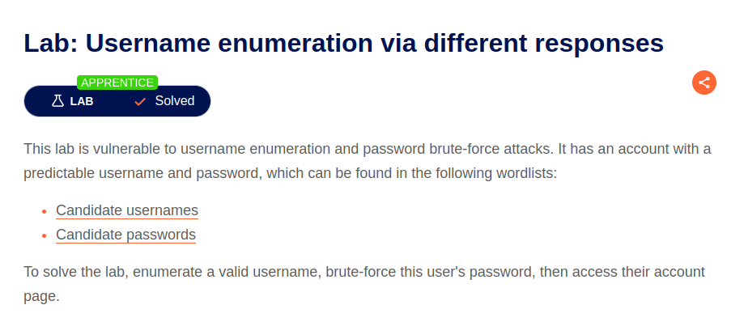
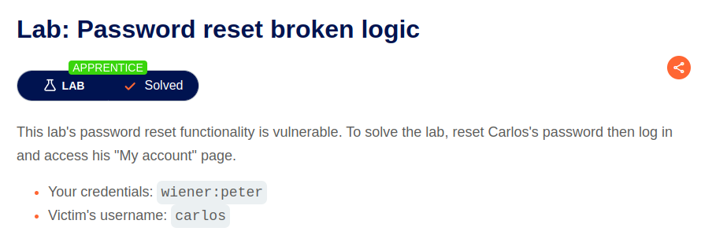
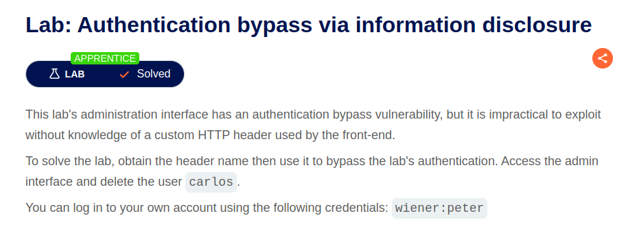
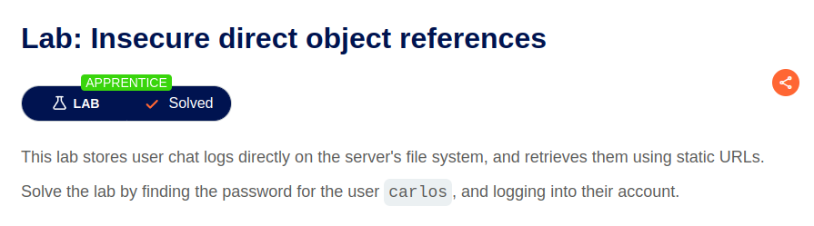
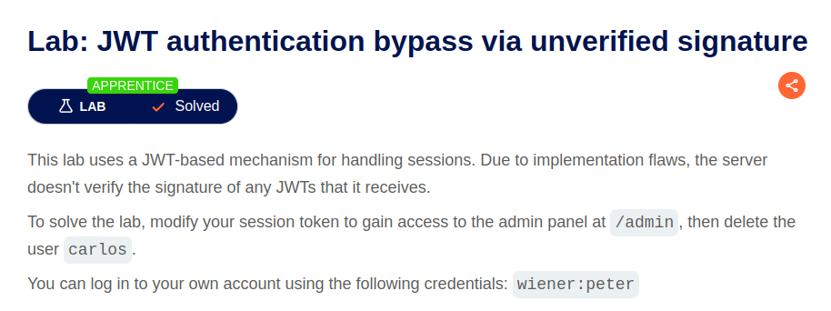

# HOMEWORK 9. Server-side attacks. Part 2

## Task 1. Username enumeration via different responses

The [lab](https://portswigger.net/web-security/authentication/password-based/lab-username-enumeration-via-different-responses)

## Task 2. Password reset broken logic

The [lab](https://portswigger.net/web-security/authentication/other-mechanisms/lab-password-reset-broken-logic)

## Task 3. Authentication bypass via information disclosure

The [lab](https://portswigger.net/web-security/information-disclosure/exploiting/lab-infoleak-authentication-bypass)

## Task 4. Insecure direct object references

The [lab](https://portswigger.net/web-security/access-control/lab-insecure-direct-object-references)

## Task 5. JWT authentication bypass via unverified signature

The [lab](https://portswigger.net/web-security/jwt/lab-jwt-authentication-bypass-via-unverified-signature)

